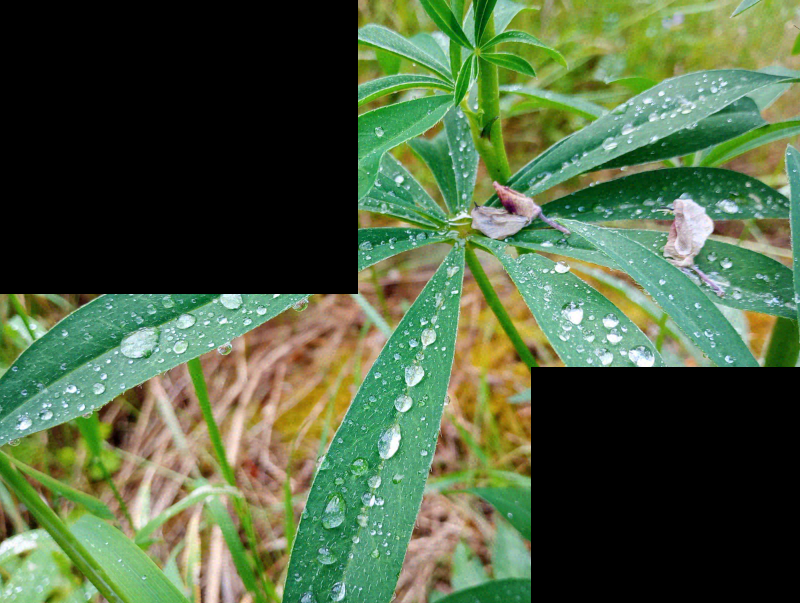
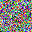

# Shadowmark

A tool for blind image watermarking based on differential embedding in DWT and DCT domains[[1]](#1). This tool supports
embedding an RGB watermark into a target image and extracting it back without needing the original image.

## Installation

Clone this repository and install the package with pip. Use of virtual environment is recommended.

```bash
git clone git@github.com:martinpres/shadowmark.git shadowmark
cd shadowmark
pip install .
```

## Usage

Let's use an input image and a watermark:

| Original image<br/>(800x603)                                    | Watermark<br/>(32x32)                       |
|-----------------------------------------------------------------|---------------------------------------------|
|  |  |

To embed the watermark to the input image:

```bash
shadowmark --image image.png --embed watermark32x32.png --output embedded.png
```

To extract the watermark from the image:

```bash
shadowmark --image embedded.png --output extracted.png
```

| Watermarked image<br/>(800x603)                                       | Extracted watermark<br/>(32x32)        |
|-----------------------------------------------------------------------|----------------------------------------|
|  |  |

### RGB channels

You can choose specific RGB channel that will be used for embedding by using the `--channels` parameter. This may be
used for both embedding and extraction or just for the extraction. Extraction of different channels than were embedded
yields just noise. Supported channels are red ('r'), green ('g') and blue ('b').

```bash
shadowmark --image image.png --embed watermark32x32.png --output embedded.png --channels g 
shadowmark --image embedded.png --output extracted.png --channels g
```

| Watermarked image<br/>channel = g<br/>(800x603)                                                                  | Extracted watermark<br/>channel = g<br/>(32x32)  |
|------------------------------------------------------------------------------------------------------------------|--------------------------------------------------|
|  |  |

You may also specify combination of channels:

```bash
shadowmark --image image.png --embed watermark32x32.png --output embedded.png --channels rg
shadowmark --image embedded.png --output extracted.png --channels rg
```

| Watermarked image<br/>channel = rg<br/>(800x603)                                                                           | Extracted watermark<br/>channel = rg<br/>(32x32)  |
|----------------------------------------------------------------------------------------------------------------------------|---------------------------------------------------|
|  |  |

### Robustness

By default, the extracted watermark may not always perfectly match the embedded one, but you may use the `--gain`
parameter to increase robustness of the embedding:

```bash
shadowmark --image image.png --embed watermark32x32.png --output embedded.png --gain 3
shadowmark --image embedded.png --output extracted.png
```

| Watermarked image<br/>gain = 3<br/>(800x603)                                                  | Extracted watermark<br/>gain = 3<br/>(32x32)  |
|-----------------------------------------------------------------------------------------------|-----------------------------------------------|
|  |  |

Note that higher gain values introduce more noise into the watermarked image, which can reduce its visual quality.

### Different watermark sizes

The watermark image is by default 32x32 pixels. You may use different sizes, but larger watermarks make the watermarked
image even noisier. The watermark size is not automatically encoded in the watermarked image, and you must specify it by
the `--extract WxH` parameter:

```bash
shadowmark --image image.png --embed watermark64x64.png --output embedded.png
shadowmark --image embedded.png --extract 64x64 --output extracted.png
```

| Watermarked image<br/>(800x603)                                                                   | Extracted watermark<br/>(64x64)              |
|---------------------------------------------------------------------------------------------------|----------------------------------------------|
|  |  |

### Seed for protection

The watermark is embedded the same way every time by default and an attacker that knows the implementation, size, gain
and channels may tamper with the watermark and damage it. To minimize the risk, you may use the `--seed` parameter to
specify a seed for the internal RNG:

```bash
shadowmark --image image.png --embed watermark32x32.png --output embedded.png --seed 20241224122442
shadowmark --image embedded.png --output extracted.png --seed 20241224122442
```

| Watermarked image<br/>seed = 20241224122442<br/>(800x603)                            | Extracted watermark<br/>correct seed<br/>(32x32)    | Extracted watermark<br/>incorrect seed<br/>(32x32)    |
|--------------------------------------------------------------------------------------|-----------------------------------------------------|-------------------------------------------------------|
|  |  |  |

> **Warning:**
> The seed parameter does not provide strong cryptographic protection.

## Resistance to attacks

| Attack                     | Example   <br/>gain = 1                                                                  | Extracted watermark<br/>gain = 1<br/>(32x32 )                    | Example   <br/>gain = 5                                                                  | Extracted watermark<br/>gain = 5<br/>(32x32 )                    |
|----------------------------|------------------------------------------------------------------------------------------|------------------------------------------------------------------|------------------------------------------------------------------------------------------|------------------------------------------------------------------|
| Grayscale                  |       |    |       |    |
| JPEG quality 60%           |  |      |  |      |
| Obstructing parts of image |   |  |   |  |
| Cropping                   |                 |         |                 |         |
| Flipping horizontally      |                 |         |                 |         |
| Rotation                   |         |     |         |     |
| Resize to half             |             |       |             |       |

## References

<a id="1">[1]</a>: Benoraira, A., Benmahammed, K. & Boucenna, N. Blind image watermarking technique based on
differential embedding in DWT and DCT domains. EURASIP J. Adv. Signal Process. 2015, 55 (
2015). https://doi.org/10.1186/s13634-015-0239-5
